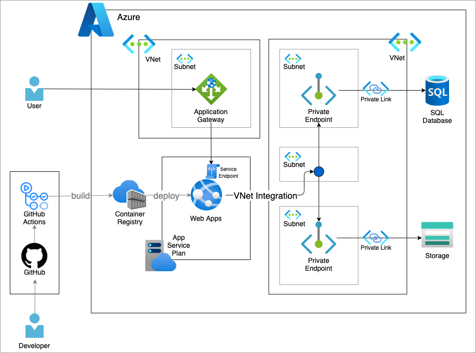

# sample-django-azure-webapps

## Architecture



# アプリ起動までの最低限の設定

## Poetryを使って必要なライブラリのインストール
Pythonのパッケージ管理にpoetryを使っています。
- https://cocoatomo.github.io/poetry-ja/

### Poetryのインストール
```sh
pip install poetry
```

### Poetryを使って必要なライブラリのインストール
`pyproject.toml`に書かれた内容に従って、必要なライブラリがインストールされます。
```sh
poetry update
```

## 　DBの準備
- テスト用のSQL Serverを用意し、`データベース`と`ユーザー`作成してください。

## SQL Server接続用にODBC Driverのインストール
下記URLを参照し、アプリを実行する環境に`Microsoft ODBC Driver 18 for SQL Server`をインストールしてください。
- https://docs.microsoft.com/ja-jp/sql/connect/odbc/download-odbc-driver-for-sql-server?view=sql-server-ver15


## Djangoの設定
- Djangoに下記のプロジェクトとアプリを追加してサンプルを作りました。
  - プロジェクト : `sampleProject`
  - アプリ : `sample`
- Djangoの設定は`sampleProject/setting.py`で設定できます。
- 今回最低限必要な設定は、環境変数に外に出しています。
- ローカルテスト用の環境変数は、`.env`fileで設定できます。

### `.env`の設定
- `.env.sample`ファイルを`.env`というfileにコピーしてください。
- `.env`に下記の必要な設定を入力してください。
```:.env
# Djangoアプリのシークレットキーになります
SECRET_KEY=

# Djangoアプリが起動できるHOST名
ALLOWED_HOSTS=localhost,127.0.0.1

# SQL ServerのHOST
MS_DB_HOST=localhost

# SQL ServerのPort
MS_DB_PORT=1433

# SQL ServerのDB名
MS_DB_NAME=django-sample-sql-db

# SQL Serverのユーザー名
MS_DB_USER=user

# SQL Serverのパスワード
MS_DB_PASSWORD=Password

# SQL Serverのドライバ名
MS_DB_DRIVER="ODBC Driver 18 for SQL Server"

# ローカルのSQL Serverで、SSLエラーが出るときは追加してください。
# 基本的に本番環境には設定しないでください。
MS_DB_EXTRA_PARAMS="TrustServerCertificate=yes"
```

## DB Migration
下記コマンドで、DBのMigrationを実施してください
```sh
poetry run python manage.py migrate
```

## アプリ起動
下記コマンドでアプリを起動してください。
- 開発用
```sh
poetry run python manage.py runserver
```

- （補足）本番用では`manage.py runserver`での起動は推奨されていませんので、`gunicorn`からも起動できるようにしています。
```sh
poetry run gunicorn sampleProject.asgi:application -w 2 -k uvicorn.workers.UvicornWorker --bind 0.0.0.0:8000
```

## サンプルアプリのDocker imageの作成・ローカルでの起動
- ルートディレクトリにある`DockerFile`にdockerイメージを作成する設定が入っていますので、`docker build` コマンドでdockerイメージを作成することができます。
- 今回は、更にローカルで楽に起動できるように`docker-compose.yml`も作りましたので、ルートディレクトリで下記コマンドで起動アプリを起動できます。
  - (注意)環境変数は`.env`ファイルから取得するようにしていますので、先に`.env`の設定をお願いします。
```sh
docker compose up
```

# SQL Serverもdockerで動かす方法について
別途`SQL Server`を立てる場合はこちらは不要です。
## SQL Serveの起動
- `sql_db_docker`配下に、SQL Server用の`docker-compose.yml`を作成しています。
- `sql_db_docker`配下に移動して、起動してください
```sh
cd sql_db_docker
docker compose up
```

## Databaseとユーザーの作成
- 上記の`docker-compose.yml`は`SQL Server`の立ち上げまでしかしてないので、Databaseとユーザーの作成は`localhost:1433`に接続してsqlコマンドを実行してください。

## アプリケーション側のdocker-compose.ymlにネットワークの設定を追加
- dbとアプリの両方を`docker compose`で動かす場合、ネットワークの設定が必要です。
- アプリ用の`docker-compose.yml`(ルート直下)でコメントアウトしてある箇所を有効化することで、ネットワークの設定が出来ます。
- このとき、アプリから指定するsql serverのホスト名は、docker上でのサービス名になります。具体的には`db`です。